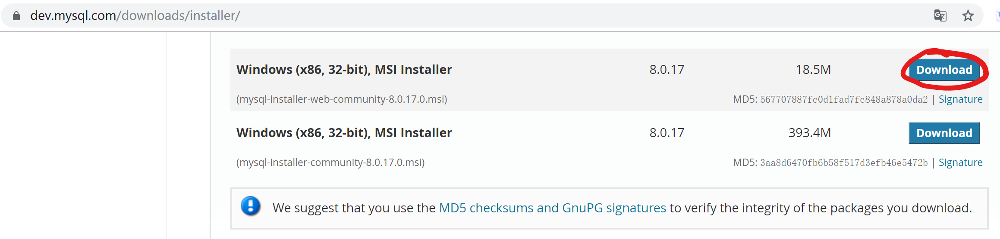
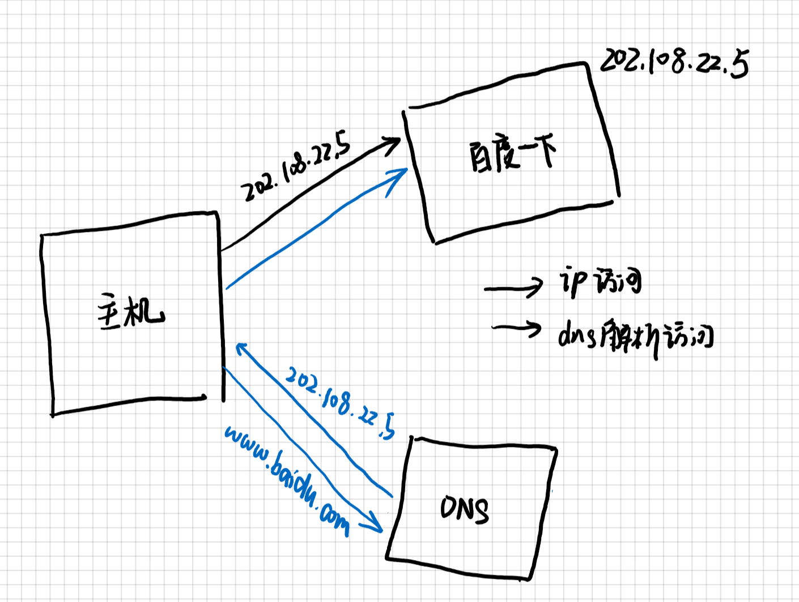
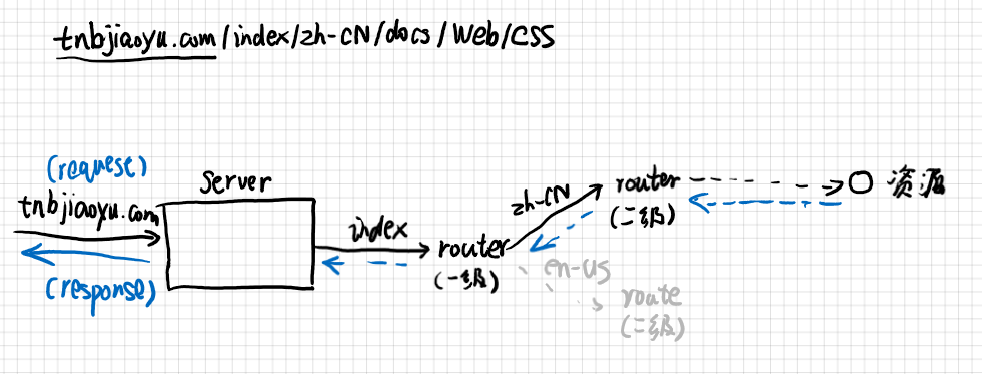
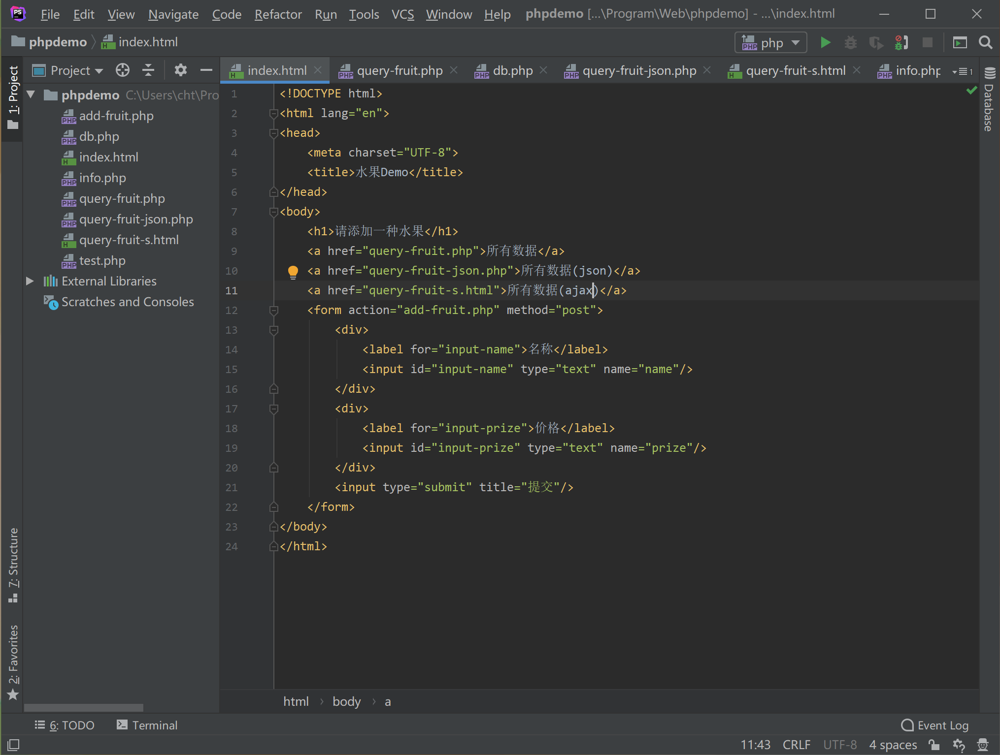
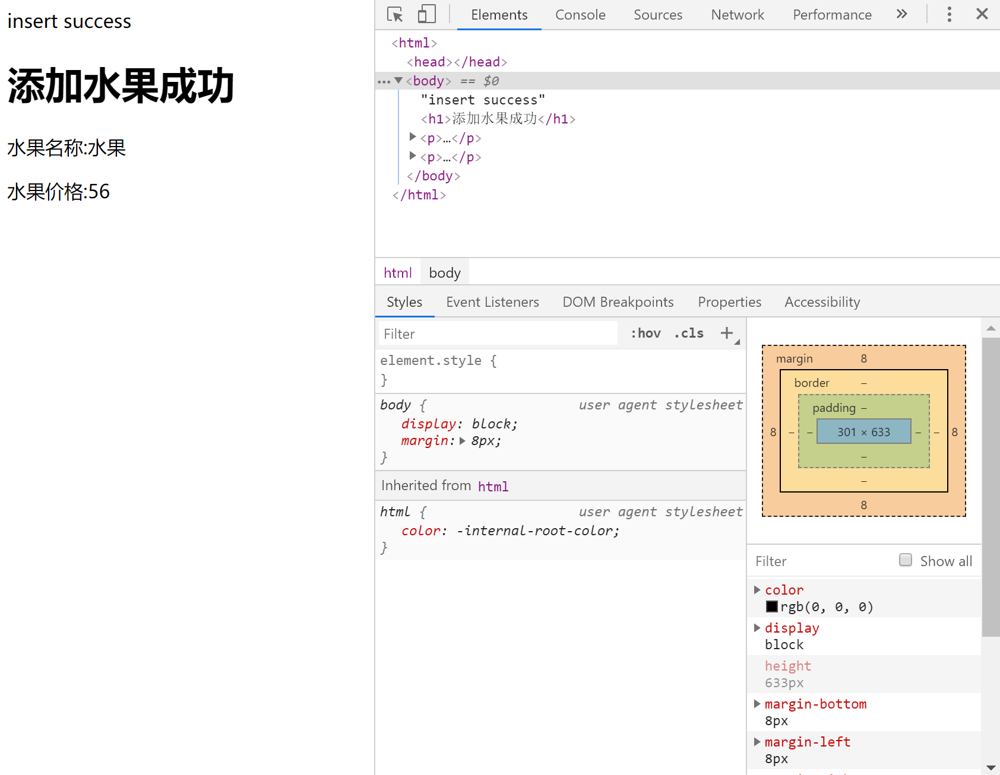

!!! info ""
    虽然这篇文章主要讲后端教程，但是为了更好的便于理解，加入了一小部分的前端知识以及传统的Web开发技术。

讲到后端，当然也免不了提到前端、运维和前端开发了，相信对前后端的运行机制进行讲解，并配合简单的代码开发，你们还快就会明白精髓的。

但是不要着急，就像生物的进化一样前后端分离也是Web开发发展到一定的产物，如果要对前后端深入了解，还是要对传统的WEB开发做一定的了解的。

## 课前软件准备

正所谓磨刀不误砍柴工，写个后端还是要不少软件的(比前端要麻烦一些)，但是这个教程系列都是在本地开发和测试的，讲网站部署到云端的教程此系列不讲。总之，我们需要以下软件：

- MySQL

    人见人爱十分友好的数据库服务(doge)，持久化状态必须的一个服务，当然，选择轻量级的SQLite3数据库也是不错的选择，但是我不会搞。  [官网链接](https://www.mysql.com/)

- PHP

    作为世界上最好的编程语言，怎么能够不使用呢，还有一点，PHP(一门脚本语言)其实对于新生来说也是挺友好的(特别是学了C++之后)。当然，Python也足够优雅，只不过需要框架的支持。[^3] [官网链接](https://www.php.net/)

    !!! info ""
        
        我下载的是这个，不过这东西据说很难卸载，这个我也不太清楚。

- Nginx

    一种Http服务器，同时也可以作为正向代理、反向代理[^6]服务器，可以运行一个网站，也可以根据特定的规则进行路由转发[^7]，相似的软件有Apache，Tomcat等。 [官网链接](http://nginx.org/)

- PhpStorm

    一款编写PHP,Html,JavaScript以及CSS的一款IDE[^8]，非常好用，由JetBrains[^9]公司开发，当然，使用Visual Studio Code开发也是可以的，Visual Studio也很优秀，当时开发网页就有点不合适了。 [官网链接](https://www.jetbrains.com/)

## ※相关资源

### [重要]例子的代码

[代码已经放在github上面](https://github.com/h1542462994/phpdemo)

### php

[laravel维护的PHP文档](https://php.golaravel.com/)

## 第一节：网页运行原理

!!! warning "网站和网页"
    网页和网站就像一本书的某一页和整本书的关系，网页通过某些关系联系在一起形成网站，此教程中，网站和网页有时候属于同一个词，只是个人的习惯叫法，不要介意。

一个`html`文档就可以作为一个静态网页，我们的后端之旅也是从这里开始的，不过，这似乎太简单了些，这一节我们要做的就是把一个静态网页集合[^2](通常称为**site**)部署到Http服务器[^4]上。同时，我们也将了解网页是如何运行的。

!!! info "Http服务器"
    Http服务器，简单来说，就是负责接受Request和发送Response的一个运行的程序。在程序运行时，它会监听一个或多个端口[^5]，一个计算机总共约有65535个端口，其中部分端口是属于特定的程序的，例如20,21是ssh；3306是数据库；80是网页的端口等等。

### 定位

#### 如何找到资源

当你输入`https://www.baidu.com/`时，你会发现他跳转到了**百度一下**这个网站，你可能会习以为常，但是你是不是觉得很奇怪，这个链接(Uri[^10])到底指向哪个地方。你也许觉得这个链接就是服务器的地址了，其实这样设计也不是不可以，但是，这并不是真正的服务器地址。

!!! info "域名和IP"
    首先看两串地址:`jh.zjut.edu.cn`和`192.168.1.1`,你觉得哪一个对于计算机来说更友好一些？相信大多数同学会选择第二个，实际上确实是这样，一开始人们也是这么设计的。
    这么说吧，如果一个保险柜里面有十分机密的文件，而你又把一把**钥匙A**放在了**抽屉B**里，而你持有**抽屉B**的**钥匙B**，那么，钥匙A就可以比作IP地址，通过IP地址可以直接找到服务器，钥匙B就可以比作域名，其需要通过抽屉B(实际上也就是DNS解析器)来打开保险柜，如果这么说还是不明白，那我就画一张图吧。

    

    当然你也可以看一个[B站的视频](https://b23.tv/av13068758)

但这样你也只是找到了服务器在哪里而已，要请求到对应的资源，需要在Uri上添加访问路径，参数以及锚点等等。请求资源通过HttpRequest进行，其分为多种模式，一般常用的有GET和POST。而通过路径定位资源就需要路由。下面是其访问的一种可能的方式，当然，对于路由，你就把他们理解为是分发邮件的员工吧：

!!! info ""
    

#### 如何部署Http服务

一般部署的服务有开发环境的服务和测试环境的服务，一般在开发环境中，使用Ngnix等服务来统一管理（访问静态文件，转发到另一个服务，请求重定向等等），具体的部署方式网站都有详细说明，只要输入*部署PHP网站*等都会给你一个满意的答案。

### 静态网页

静态网页，就是一个无状态的网页，是最简单的一种网页，我们的入门也是从这里开始的。

#### DEMO

!!! warning "安装"
    从这里开始请关注你已经安装了Php或者PhpStorm。当然，这里直接使用**PHP服务器**来进行讲解

!!! summary ""
    
    最简单的就是内置的服务器了，配置的方式可以参考[msdn文章](https://blog.csdn.net/u011244446/article/details/53064788)

首先我们很简单的搭建一个`form`表单，运行查看效果。

### 传统的网页

#### 临时的数据存储

传统的网页往往前后端是不分离的，php的逻辑是当你访问一个页面时，其首先运行`<?php?>`这些语言，将其进行处理后然后才返回一个`html`文档，这与写在html中的`javascript`不同，前者是运行在服务器中的，后者是运行在浏览器中的。并且，使用php来返回的页面往往观察不到其内部的实现逻辑，而`javascript`却不行。传统的网页采用的是预渲染的技术，这样就会把数据库事务的处理以及页面的生成都交给后端去做了，如果项目较大，这样就显得逻辑不够清晰，而且后端压力也会变大。

尝试运行我写的例子，打开F12，并输入一些文字，提交，查看效果，你就会发现，这里并没有什么php代码，这都是因为后端已经处理完了。



这就是一种传统的网页，其主要有两个不美观的地方，第一是提交时其总是会跳转页面（这就是表单提交后必然发生的事情，虚拟表单除外），第二是路径的问题(你连.php都告诉别人了)。这两种方式后面都会改进。

#### 添加持久化服务-数据库的应用

当然，为了让服务器拥有状态我们需要一种持久化的服务，在这个例子中就是MySQL数据库，数据库就相当于仓库，你的每一次访问都可能长久性的修改仓库里面的东西。数据库最常见的操作就是CRUD（简称增删改查操作）。当然，数据库刚开始操作还是有点麻烦的，关键是各种接口有点麻烦，但是官方文档是很全的。

到这里，你就会发现一个传统的网页似乎是这样运行的：


当然，这里的图是不完整的，数据库服务是一个必不可少的因素。随着网页的发展，后来又出现了MVC、MVT几种模式，已经有前后端分离的雏形了。


## 第二节：前后端分离技术

### 简单介绍

你也许认为实现前后端分离毫无头绪，实际上我一开始学也是这样，要理解前后端需要理解**这些代码实在服务器还是浏览器上执行的**，以及前后端之间究竟应该如何联系呢？

从之前的学习我们知道，php代码在后台执行，嵌入到html文档中的代码在浏览器上执行，而前后端分离的思想是：前端只负责编写浏览器上运行的代码，而后端则编写服务器上运行的代码。这样，前端就只需要负责编写数据的呈现以及验证，后端则编写数据库的逻辑。

这样一来，前后端就分开了，那前端怎样告诉后端要干什么呢，答案就在HttpRequest这里，而这时服务器的返回有所不同，传统的Web技术返回的是一个页面，这是人们非常乐意去看的，然而这对于机器来说非常难以理解，而这时需要一种数据交换技术，这种技术称为序列化/反序列化技术，热门的数据交换格式为json。

### 后端编写-返回json

首先，后端需要给外界开放一个接口，来让外界进行一系列的操作。同时，返回一个界面对于机器来说难以解释，因此就需要数据交换格式，一般网页中常用的有xml和json两种格式，为了讲解这个，我们需要先抛出一个概念：序列化和反序列化。

!!! info "序列化和反序列化"
    一个变量占有的数据是以二进制保存在内存中的，而有时这种数据需要缓存下来，或者传给另外一个运行的应用，而序列化就是将数据对象转化成字符串的过程（一般分为二进制序列化(常见的有以.dat,.bin结尾的文件)和字符串序列化），将一个内存的对象转化成字符串的过程就是序列化，由于json简单的键值表述法，其经常在网页的前后端交互中使用。

你可以看我的[另外一篇文章](/doc_user#_11)来了解json使用的一个例子。

```php hl_lines="3 8" linenums="1"
<?php
include 'db.php';
header('content-type:application/json');
$res = new stdClass();
$res->status='ok';
$res->msg='查询成功';
$res->data=_query_all();
echo json_encode($res);
```

其中第3行和第8行是关键的代码，第3行表示返回的是一个json的字符串，第8行表示把对象编码(其实就是序列化)成json字符串。

### 前端请求-解析json

这部分就是前端的工作了，当然，对于后端来说，json的格式也是要按照一定的规范的，总不能每次请求格式都不太一样吧。为了前端工作，我们也常常设计api和相应的**文档**，来供其他开发者来使用。文档对于个人开发来说可以不写，但是对于团队来说，写文档对于持续的维护工作就很有意义。

```html hl_lines="24 30" linenums="1"
<!DOCTYPE html>
<html lang="en">
<head>
    <meta charset="UTF-8">
    <title>测试</title>
    <script src="http://ajax.aspnetcdn.com/ajax/jQuery/jquery-1.8.0.js"></script>
</head>
<style>
    ul>li>span{
        color:#a52;
    }
</style>
<body>
    <p>所有记录</p>
    <button onclick="load()">加载</button>
    <ul id="record">

    </ul>
</body>
<script>
    function load(){
        let html_obj= $.ajax({url:'/query-fruit-json.php',async:false});
        console.log(html_obj.responseText);
        let json = JSON.parse(html_obj.responseText);
        if (json.status === 'ok'){
            $("#record").empty();
            for (let i = 0; i < json.data.length; i++) {
                let _each = json.data[i];
                console.log(_each);
                $("#record").prepend('<li><em>name:</em> ' + _each.fruit_name +'<em>prize:</em> ' + _each.prize + '</li>');
            }
        }

    }
</script>
</html>
```

关键的代码是24行和30行，24行将一个字符串对象解析成一个json对象（实际上json就是javascript对象表示法），30行就是对data数据进行显示的作用。

当然，这里要顺便提一句ajax函数。ajax支持异步请求，当然在这个例子中并没有使用异步。异步的话涉及到多线程的知识，比较复杂，简单说就是我要执行另一个任务了，但是我当前的任务还要继续做。

## 第三节：优雅的后端框架Laravel

我们要注意，前面的例子没有使用框架(除了jquery这个插件)，这样做能够更好的理解代码，但是对于项目来说，使用原生开发效率是一个很大的问题，但是确实方便。今天介绍的是一个PHP的后端框架Laravel。

### 路由-更好的管理Uri

我们看例子代码，他使用文件路径作为资源的标签，这种方式容易暴露，而且看起来不是很直观，这是我们就需要路由来管理页面，路由就相当于一个关隘，负责分发任务和回调，为了更好的管理一般使用多级路由的方式。路由的具体实现目前还没有编写，过段时间进行补充。

### ORM-面向对象的优雅操作

学习一门语言虽然很快，但是使用的语言多了之后就会觉得繁琐，况且，各个公司提供的数据库的api(即SQL语句)都不太一样，所以我们需要给数据库包一层壳，用对象表示法来间接操作数据库，这种技术叫做ORM技术。这样的话就可以更加优雅的操作数据库了。

## 第四节：其他随便写写的知识点

编程语言很多，但是其思路是差不多的，一般学了基础的语法就可以直接上手，万一碰到不会的知识点，网上找一下，一般都会有函数或者前人写好的插件和框架，对于程序员这个行业来说，除了掌握编程技能之外，我觉得有些知识还是要学的：

首先，markdown是一门不错的编写文档的语言，实际上，这个教程就是用markdown来写的，语法简单，一学就会，但是要加以练习才会写的得心应手。这个文档的框架是Python语言开发的mkdocs，写文档还是不错的。除此之外，还有必要对Git和Github做一定的了解。

## 后端免笔试任务

后端免笔试任务初步定为（还没有确定）编写一个简单的登录系统，要求前后端分离（只编写后端的部分）功能包括注册，登录和自动登录（**可以不写**）三个部分。后端的话只要写个返回Json的API就可以了。

三个部分要求对字段的合法性进行检查，并且能够就错误的输入也返回一段Json信息。

注册：以用户名+密码的方式进行注册，当然可以考虑加入昵称，用户名也可以随机生成。
登录：以用户名+密码的方式进行登录，返回用户的基础信息和登录的凭证Token用以自动登录。
自动登录：使用Token进行自动登录，并返回用户的基础信息和更新后的Token。


[^3]: Python的话个人用的较多的框架是Django+rest，具体请查看[官网](https://docs.djangoproject.com/zh-hans/2.1/)
[^6]: 正向代理、反向代理：[介绍文章](https://www.jianshu.com/p/ae76c223c6ef)，这个过程类似于中介，也可以称为信息的搬运工。
[^7]: 转发：转发就是某一个结点（页面）无法处理请求，用某种方式从其他地方获取资源的过程，一般分为路由和重定向，路由(route)就是往子页面请求数据，并返回的过程，就像递归一样。而重定向就是直接告诉请求方我这个服务处理不了，请另寻高见吧。
[^8]: IDE：集成开发环境，把大多数操作集成在一起，专为程序员设计，所以，请忘了Vim开发就是大佬这个梗吧。
[^9]: JetBrains: 一块专门写IDE的一个公司，几乎涵盖（好像是涵盖所有）所有的编程语言，使用edu白嫖专业版的教程请自行百度。[官网](https://www.jetbrains.com/)
[^1]: 静态网页：通俗的讲，就是无状态的网页，当然，这里的无状态指的是网页的内容不依赖于用户的操作。例如，这个文档就是一个典型的静态网页。
[^2]: 静态网页集合：实际上就是一个含有几张`html`的文件夹，通过链接的方式组织在一起。
[^4]: 也叫Web服务器，这是一篇[博客](https://blog.csdn.net/bibiboyx/article/details/87911931)，有小部分解释。
[^5]: 端口(Port)：可以理解为计算机和外界进行交换数据的一扇门，所有的数据都必须经过端口才能和外界进行通信，而监听端口，就相当于派兵驻扎了这扇门，它不允许其他军队驻扎，而且时时刻刻都要看看有没有人走进或者走出，并采取相应的动作。
[^10]: Uri: 统一资源标识符，是一种国际标准，用于唯一标识一个资源，与其相似的名词有Url和Urn，如果你需要进一步的了解，还是自己查询吧，我找不到一篇较为详细的文献。
