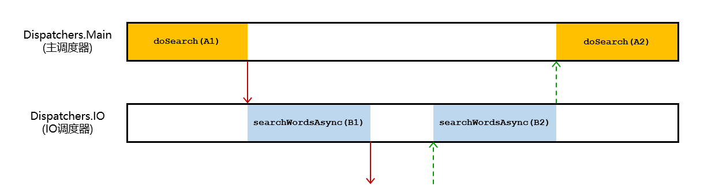
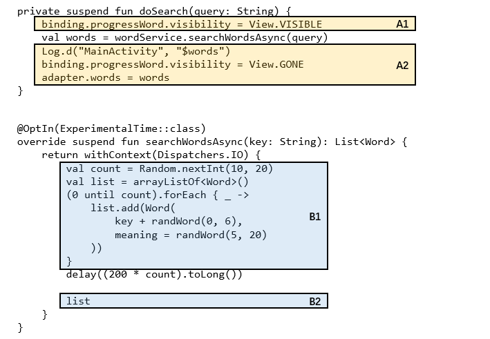

# 协程源码解读

协程（Coroutine）是Kotlin的核心库之一，是一个轻量级的解决了异步非阻塞编程方式的框架。协程并不同于线程，因为协程并不是操作系统构成的一部分。协程更像是一种应用级线程，在协程中的任务由协程本身来实现调度、线程切换和监控。

协程相对于线程具有很多优点：

1. 协程更省内存空间。

2. 协程支持自动取消。

3. 协程支持同步化编码。

## 举例

我们简单的使用一个单词搜索程序来举例。使用一个搜索框，调用服务搜索匹配的单词序列，并返回结果。

单词搜索服务如下：

```kotlin
interface WordService {
    suspend fun searchWordsAsync(key: String): List<Word>
}

class WordServiceA: WordService {
    private fun randWord(start: Int, endExclusive: Int): String {
        val count = Random.nextInt(start, endExclusive)
        val sb = StringBuilder()
        (0 until count).forEach { _ ->
            sb.append('a' + Random.nextInt(0, 26))
        }
        return sb.toString()

    }

    @OptIn(ExperimentalTime::class)
    override suspend fun searchWordsAsync(key: String): List<Word> {
        return withContext(Dispatchers.IO) {
            val count = Random.nextInt(10, 20)
            val list = arrayListOf<Word>()
            (0 until count).forEach { _ ->
                list.add(Word(
                    key + randWord(0, 6),
                    meaning = randWord(5, 20)
                ))
            }
            delay((200 * count).toLong())

            list
        }
    }
}
```

单词序列是随机生成的，并且需要2s~4s的时间来生成。

在MainActivity中的使用如下：

```kotlin
    private fun startSearch(query: String) {
        searchJob?.cancel()
        searchJob = mainScope.launch {
            doSearch(query)
        }
    }

    private suspend fun doSearch(query: String) {
        binding.progressWord.visibility = View.VISIBLE
        val words = wordService.searchWordsAsync(query)
        Log.d("MainActivity", "$words")
        binding.progressWord.visibility = View.GONE
        adapter.words = words
    }
```

我们实际使用一次，发现单词搜索功能是正常的。

## Suspend

suspend是kotlin中的保留字，其标识一个函数为可挂载函数。也就是说，该函数可以中断或者恢复。这当然不是由函数本身完成的，而是通过编译器生成了另外一个函数。协程通过调用该函数来实现函数之间的跳转以及线程的切换。



如上图，我们可以知道，协程库在整个搜索的执行期间至少做了4次切换的工作。他们对应的代码段如下。



那么协程是如何实现在Suspend之前进行跳转的呢？Kotlin编译器将会为每个挂起函数创建一个状态机，这个状态机将为我们管理协程的操作。

在我们没有使用Suspend之前，我们可以通过回调来实现上面的例子。因此，Kotlin编译器也是通过编译来实现“回调”的。

我们以`doSearch`函数作为例子，可以发现，`doSearch`包括了两个函数片段，我们完全可以使用两个非挂载的函数去替换`doSearch`。在`doSearch`中，两次不同的调用具有不同的初始状态以及返回值。

而编译`doSearch`至少需要以下信息。

1. 存储当前调用的位置。
2. 被恢复执行(Resume)时的信息。
3. 需要存储的所有临时变量。

### Continuation

挂起函数通过Continuation对象在方法之间互相通信。Continuation其实只是一个具有额外信息的回调接口，稍后我们会看到，他会实例化挂起函数所生成的状态机。


```kotlin
interface Continuation<in T> {
  public val context: CoroutineContext
  public fun resumeWith(value: Result<T>)
}
```

注意: 从 Kotlin 1.3 开始，您也可以使用 resumeWith 对应的扩展函数:resume (value: T) 和resumeWithException (exception: Throwable)。

编译器将会在函数签名中使用额外的completion参数来代替suspend修饰符。而该参数将会被用于向调用该挂起函数的协程返回结果。

```kotlin
fun doSearch(query: String, completion: Continuation<Any?>) {
    binding.progressWord.visibility = View.VISIBLE
    val words = wordService.searchWordsAsync(query)
    Log.d("MainActivity", "$words")
    binding.progressWord.visibility = View.GONE
    adapter.words = words
    completion.resume(null) // 通知返回
}
```

其实，挂起函数在字节码中返回的是 Any。因为它是由 T | COROUTINE_SUSPENDED 构成的组合类型。这种实现可以使函数在可能的情况下同步返回。

### 生成状态机

特殊说明: 本文接下来所展示的，并不是与编译器生成的字节码完全相同的代码，而是足够精确的，能够确保您理解其内部发生了什么的 Kotlin 代码。这些声明由版本为 1.3.3 的协程库生成，可能会在其未来的版本中作出修改。

Kotlin 编译器会确定函数何时可以在内部挂起，每个挂起点都会被声明为有限状态机的一个状态，每个状态又会被编译器用标签表示:

```kotlin
fun doSearch(query: String, completion: Continuation<Any?>) {
    when(label) {
        {
            // A1 --> 第一次调用
            binding.progressWord.visibility = View.VISIBLE
            wordService.searchWordsAsync(query)
        }
        {
            // A2 --> 从wordService恢复
            Log.d("MainActivity", "$words")
            binding.progressWord.visibility = View.GONE
            adapter.words = words
            completion.resume(null) // 通知返回
        }
        else -> throw IllegalStateException(...)
    }
}
```

```kotlin
@OptIn(ExperimentalTime::class)
override fun searchWordsAsync(key: String, completion: Continuation<Any?>): List<Word> {
    return withContext(Dispatchers.IO) {
        when(label) {
            {
                // B1 --> 第一次调用
                val count = Random.nextInt(10, 20)
                val list = arrayListOf<Word>()
                (0 until count).forEach { _ ->
                    list.add(Word(
                        key + randWord(0, 6),
                        meaning = randWord(5, 20)
                    ))
                }
                delay((200 * count).toLong())
            }
            {
                // B2 --> 从Delay恢复
                completion.resume(list)
            }
        }
        else -> throw IllegalStateException(...)
    }
}
```

接下来，编译器会创建一个私有类，它会：

1. 保存必要的数据
2. 递归调用doSearch函数来恢复执行

编译器生成类的近似版本

```kotlin
fun doSearch(query: String?, completion: Continuation<Any?>) {
    class DoSearchStateMachine(
        // completion参数是调用了doSearch的函数的回调
        completion: Continuation<Any?>
    ): CoroutineImpl(completion) {
        // suspend的本地变量
        var words: List<Word>? = null

        // 所有CoroutineImpls都包含的通用对象
        var result: Any? = null
        var label: Int = 0

        // 这个方法再一次调用了doSearch来切换
        // 状态机（标签会已经处于下一个状态）
        // result将会是前一个状态的计算结果
        override fun invokeSuspend(result: Any?) {
            this.result = result
            doSearch(null, this)
        }
    }
}
```

首先需要知道的是:

1. 函数是第一次被调用；
2. 函数已经从前一个状态中恢复。

```kotlin
fun doSearch(query: String?, completion: Continuation<Any?>) {
  ...

  val continuation = completion as? DoSearchStateMachine ?: DoSearchStateMachine(completion)
  ...
}
```

如果是第一次调用，它将创建一个新的 DoSearchStateMachine 实例，并将 completion 实例作为参数接收，以便它记得如何恢复调用当前函数的函数。如果不是第一次调用，它将继续执行状态机 (挂起函数)。

现在，我们来看看编译器生成的用于在状态间切换并分享信息的代码:

```kotlin
/* Copyright 2019 Google LLC.  
   SPDX-License-Identifier: Apache-2.0 */
fun doSearch(quert: String?, completion: Continuation<Any?>) {
    ...

    val continuation = completion as? DoSearchStateMachine ?: DoSearchStateMachine(completion)

    when(continuation.label) {
        0 -> {
            // 错误检查
            throwOnFailure(continuation.result)
            // 下次 continuation 被调用时, 它应当直接去到状态 1
            continuation.label = 1
            // Continuation 对象被传入 logUserIn 函数，从而可以在结束时恢复 
            // 当前状态机的执行
            binding.progressWord.visibility = View.VISIBLE
            wordService.searchWordsAsync(query, continuation)
        }
        1 -> {
            // 检查错误
            throwOnFailure(continuation.result)
            // 获得前一个状态的结果
            continuation.words = continuation.result as List<Word>
            Log.d("MainActivity", "$words")
            binding.progressWord.visibility = View.GONE
            adapter.words = words
            continuation.completion.resume(null)
        }
        else -> throw IllegalStateException("...")
    }
}
```

### 使用不同的Dispatcher

Continuation 有一个子类叫[DispatchedContinuation](https://github.com/Kotlin/kotlinx.coroutines/blob/master/kotlinx-coroutines-core/common/src/internal/DispatchedContinuation.kt)，它的 resume 函数会执行一次调度调用，并会调度至 CoroutineContext 包含的 Dispatcher 中。除了那些将 isDispatchNeeded 方法 (会在调度前调用) 重写为始终返回 false 的 Dispatcher.Unconfined，其他所有的 Dispatcher 都会调用 dispatch 方法。