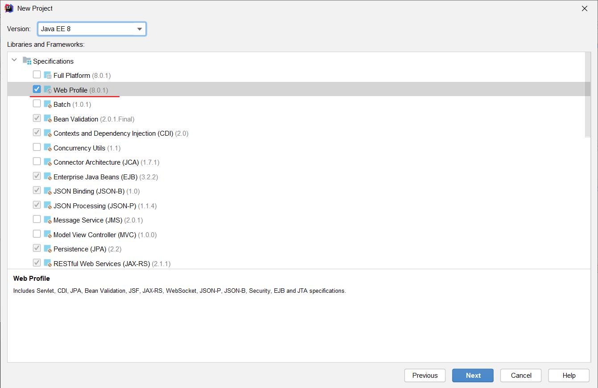
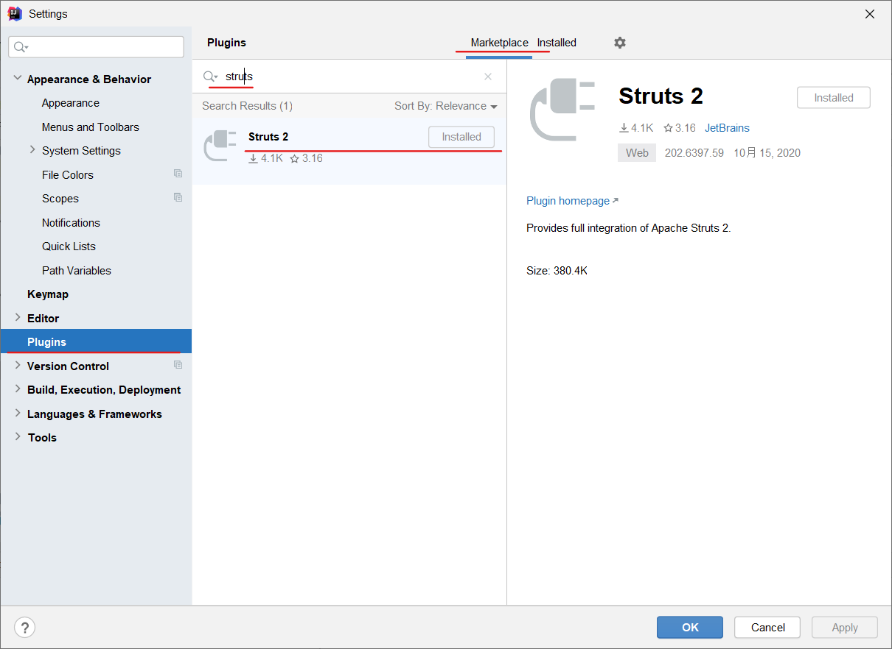
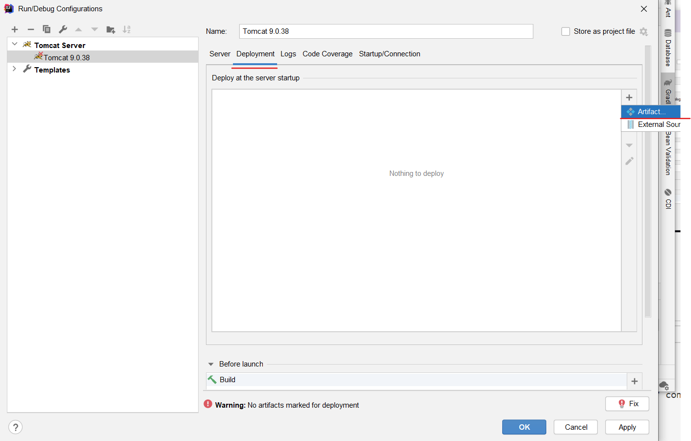
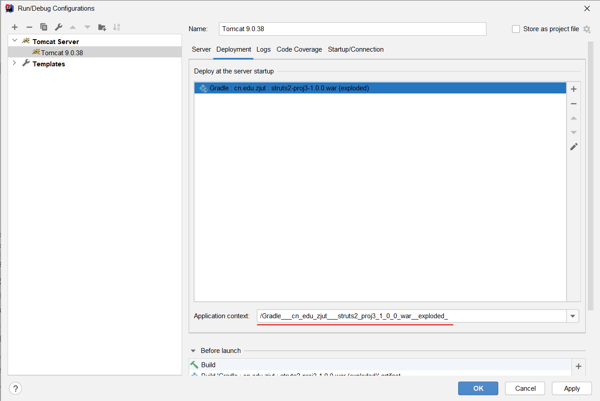
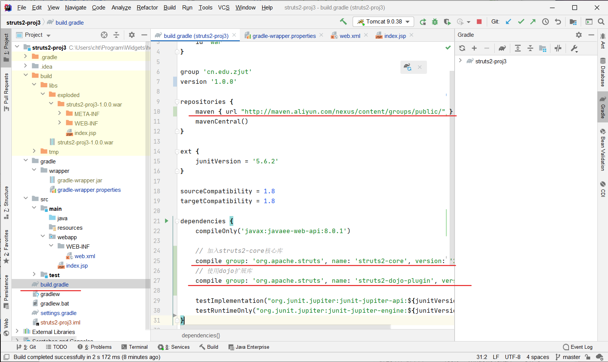
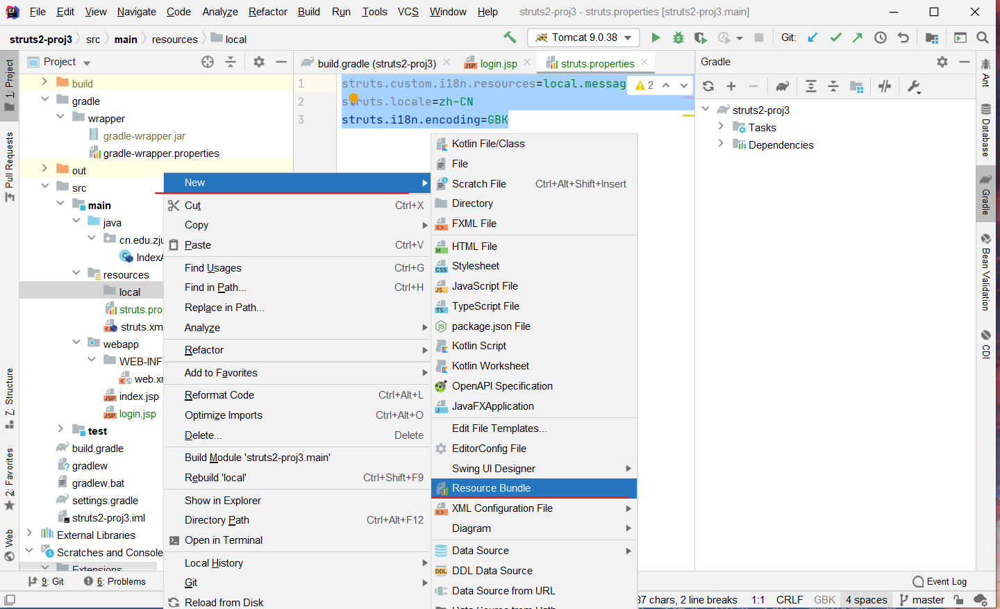
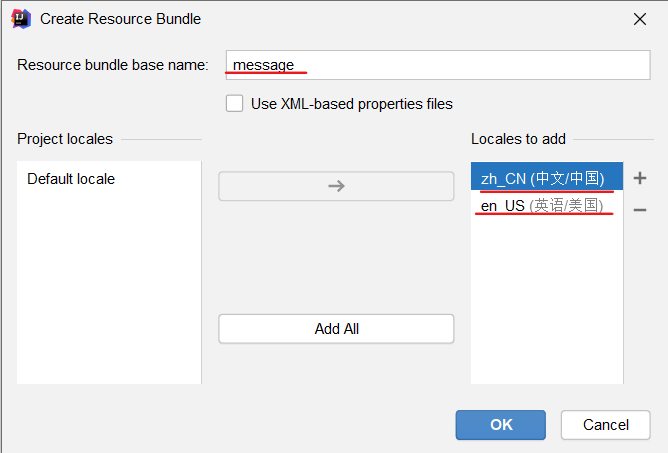
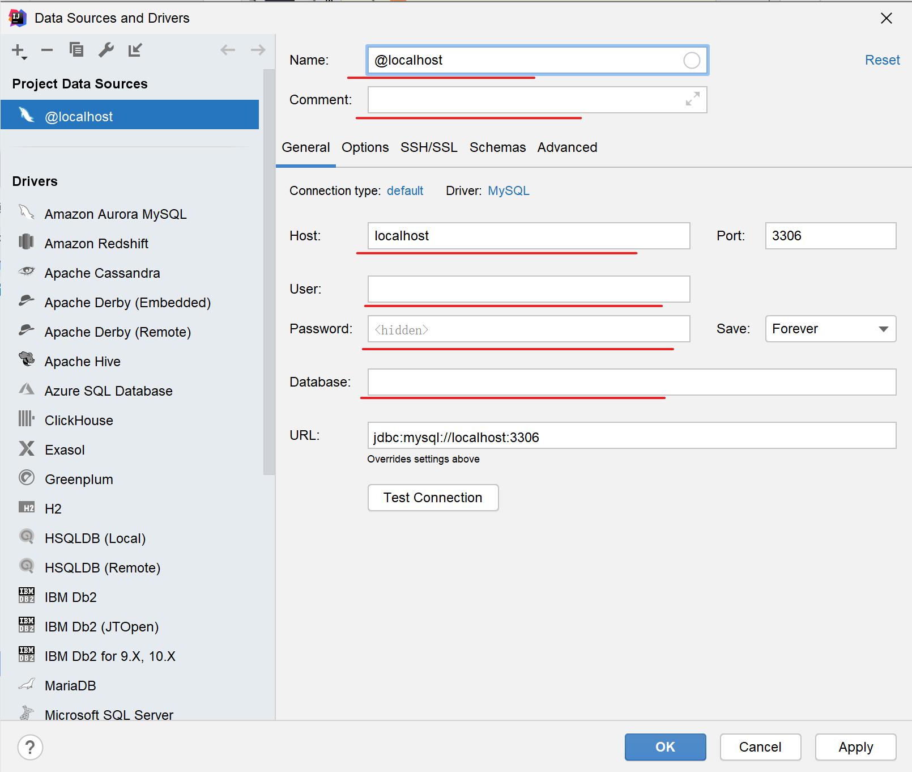

!!! info "类型：笔记"
    前置：*web\start* <br/>
    2020.10.24 创建并添加**项目配置**部分 <br/>
    2020.11.3 创建并添加**Hibernate**部分

## struts2项目的创建和配置

!!! tip "配置环境"
    tomcat：apache-tomcat-9.0.38 <br/>
    IDE：IntelliJ IDEA 2020.2.3 <br/>
    Language：java8 / java 11 <br/>
    package manager：gradle-6.5.1-all <br/>
    struts2-core：2.5.25 <br/>
    struts2-dojo-plugin：2.3.37

### 创建新项目

#### 打开IntelliJ IDEA，选择**New Project**

#### 选择**Java Enterprise**，然后选择包管理器为**Gradle**


#### 选择Web Profile



#### 选择路径等内容


### 修改默认配置

#### 修改gradle的配置


打开`gradle\wrapper\gradle-wrapper.properties`，修改`distributionUrl`为`...gradle-6.5.1-all.zip`，然后重新build程序

#### 删除默认的3项内容


#### 添加struts2插件

选择`File>Settings`，然后选择`Plugins`，在`Marketplace`中搜索**struts 2**，然后安装。



#### 创建主页

在`src\webapp`下创建index.jsp，然后修改内容为`Hello world`


#### 设置启动设置

点击`Add Configuration`，然后点击`+`，再找到`Tomcat Server>Local`


再将菜单栏切换到`Deployment`下，点击右侧的`+`，选择`Artifact..`



选择下方`exploded`的版本


选择`Application Context`为一个合适的路径（例如`/strut2-proj3`）



点击`OK`，完成配置

!!! info "测试"
    现在，点击绿色按钮，你可能会看到下列提示消息，说明此时项目还没有配置好
    ```
    [2020-10-24 10:58:22,928] Artifact Gradle : cn.edu.zjut : struts2-proj3-1.0.0.war (exploded): com.intellij.javaee.oss.admin.jmx.JmxAdminException: com.intellij.execution.ExecutionException: C:\Users\cht\Program\Widgets\homework.gallery\computer science\javaee\struts2-proj3\build\libs\exploded\struts2-proj3-1.0.0.war not found for the web module.
    ```

!!! tip "修改启动默认方式"
    一般来说**Redeploy**的速度要比**Restart Server**的速度要快，可以修改启动项配置的**On 'Update' action**为*Redeploy*

#### 修改gradle的配置

点击`File>Settings`，搜索`Gradle`，找到`Build,Execution,Deployment>Build Tools>Gradle`，，将`Build and run using`和`Run tests using`均修改为**IntelliJ IDEA**


!!! info "再次测试"
    现在，点击绿色按钮，如果配置成功，你将会看到"Hello world!"，表明Java Web部分的配置已经完成。

### 为项目添加struts2的支持

#### 修改`build.gradle`文件，添加两个依赖，并导入两个依赖包



参考配置如下，然后重新build项目

```gradle
plugins {
    id 'java'
    id 'war'
}

group 'cn.edu.zjut'
version '1.0.0'

repositories {
    maven { url "http://maven.aliyun.com/nexus/content/groups/public/" }
    mavenCentral()
}

ext {
    junitVersion = '5.6.2'
}

sourceCompatibility = 1.8
targetCompatibility = 1.8

dependencies {
    compileOnly('javax:javaee-web-api:8.0.1')

    // 加入struts2-core核心库
    compile group: 'org.apache.struts', name: 'struts2-core', version: '2.5.25'
    // 使用dojo扩展库
    compile group: 'org.apache.struts', name: 'struts2-dojo-plugin', version: '2.3.37'

    testImplementation("org.junit.jupiter:junit-jupiter-api:${junitVersion}")
    testRuntimeOnly("org.junit.jupiter:junit-jupiter-engine:${junitVersion}")
}

test {
    useJUnitPlatform()
}
```

#### 创建`struts.xml`

在`src\resources`目录下，创建`struts.xml`文件


#### 修改`Project Structure`

点击`File > Project Structure`，进行配置

切换到`WebFacet`，然后删除`JPA`


点击`+`，添加`struts2`


在选择`Parent Facet`时，点击那一项，然后点击`Next`。

选择右边的`+`好，然后勾选上所有的项目，点击OK


返回上级目录后，再次点击OK

#### 修改`web.xml`文件

修改`web.xml`文件，然后添加全局的`struts 2`过滤器

参考代码如下

```xml
<?xml version="1.0" encoding="UTF-8"?>
<web-app xmlns="http://xmlns.jcp.org/xml/ns/javaee"
         xmlns:xsi="http://www.w3.org/2001/XMLSchema-instance"
         xsi:schemaLocation="http://xmlns.jcp.org/xml/ns/javaee http://xmlns.jcp.org/xml/ns/javaee/web-app_4_0.xsd"
         version="4.0">
    <filter>
        <filter-name>struts2</filter-name>
        <filter-class>org.apache.struts2.dispatcher.filter.StrutsPrepareAndExecuteFilter</filter-class>
    </filter>
    <filter-mapping>
        <filter-name>struts2</filter-name>
        <url-pattern>/*</url-pattern>
    </filter-mapping>
</web-app>
```

## 添加第一行代码

### 开始

#### 添加action类

添加包`cn.edu.zjut.action`（可以根据实际情况变化），然后添加`IndexAction`类，添加以下代码

```java
package cn.edu.zjut.action;

import com.opensymphony.xwork2.ActionSupport;

public class IndexAction extends ActionSupport {
    private Integer count;
    
    public IndexAction(){
        count = 0;
    }
    
    public String execute(){
        ++count;
        return SUCCESS;
    }
}
```

#### 修改`struts.xml`文件

配置`package`，`action`等，代码如下

```xml
<?xml version="1.0" encoding="UTF-8"?>

<!DOCTYPE struts PUBLIC
        "-//Apache Software Foundation//DTD Struts Configuration 2.5//EN"
        "http://struts.apache.org/dtds/struts-2.5.dtd">

<struts>
    <package name="strutsBean" extends="struts-default" namespace="/">
        <action name="index" class="cn.edu.zjut.action.IndexAction" method="execute">
            <result name="success">/index.jsp</result>
        </action>
    </package>
</struts>
```

#### 测试效果

在菜单栏中输入`http://localhost:8080/strut2-proj3/index.action`，如果显示"Hello world!"就表示配置成功了。


### 国际化

#### 添加国际化(i18n)的支持

在项目文件夹的`src\resources`中，添加`struts.properties`，然后添加下列内容。

```
struts.custom.i18n.resources=local.message
struts.locale=zh-CN
struts.i18n.encoding=GBK
```

然后在`src\resources`中，添加`local`文件夹，然后添加`Resource Bundle`



命名为`message`，然后添加两个Locale，分别为`en_US`和`zh_CN`



切换到`Resource Bundle`，进行编辑。


#### 国际化乱码

打开`File>Setting`，找到`Editor>File Encoding`栏

将`Project Encoding`修改为**UTF-8**，再勾选下方的**Transparent native-to-ascii conversion**


### 拦截器

#### 添加拦截器

在`src\main\java\cn.edu.zjut`下创建package`interceptors`，然后创建`AuthorityInterceptor.java`，代码如下

```java
package cn.edu.zjut.interceptors;

import com.opensymphony.xwork2.*;
import com.opensymphony.xwork2.interceptor.*;

import java.util.Map;

public class AuthorityInterceptor extends AbstractInterceptor {
    @Override
    public String intercept(ActionInvocation invocation) throws Exception {
        System.out.println("Authority Interceptor executed!");
        ActionContext actionContext = invocation.getInvocationContext();
        Map<String, Object> session = actionContext.getSession();
        String user = (String)session.get("user");
        if (user != null){
            return invocation.invoke();
        } else {
            actionContext.put("tip", "您还没有登录，请输入用户名和密码登录系统");
            return Action.LOGIN;
        }
    }
}
```

然后在`struts.xml`中添加对应的配置，参考配置如下

```xml
<?xml version="1.0" encoding="UTF-8"?>

<!DOCTYPE struts PUBLIC
        "-//Apache Software Foundation//DTD Struts Configuration 2.5//EN"
        "http://struts.apache.org/dtds/struts-2.5.dtd">

<struts>
    <package name="strutsBean" extends="struts-default" namespace="/">
        <interceptors>
            <interceptor name="authority" class="cn.edu.zjut.interceptors.AuthorityInterceptor"/>
        </interceptors>
        <action name="index" class="cn.edu.zjut.action.IndexAction" method="execute">
            <result name="success">/index.jsp</result>
        </action>
        <action name="login" class="cn.edu.zjut.action.UserAction" method="login">
            <result name="success">/loginSuccess.jsp</result>
            <result name="fail">/login.jsp</result>
            <result name="input">/login.jsp</result>
        </action>
        <action name="register" class="cn.edu.zjut.action.UserAction" method="register">
            <result name="success">/registerSuccess.jsp</result>
            <result name="fail">/register.jsp</result>
            <result name="input">/register.jsp</result>
        </action>
        <action name="allItems" class="cn.edu.zjut.action.ItemAction" method="getAllItems">
            <result name="success">/itemList.jsp</result>
            <!-- 配置系统默认拦截器 -->
            <interceptor-ref name="defaultStack"/>
            <!-- 配置authority拦截器 -->
            <interceptor-ref name="authority"/>
        </action>
    </package>
</struts>
```

#### 拦截器的配置

[教程](https://www.cnblogs.com/libin6505/p/10429283.html)

## 提高

### 添加Hibernate框架的支持

!!! tip "配置环境"
    tomcat：apache-tomcat-9.0.38 <br/>
    IDE：IntelliJ IDEA 2020.2.3 <br/>
    Language：java8 / java 11 <br/>
    package manager：gradle-6.5.1-all <br/>
    struts2-core：2.5.25 <br/>
    struts2-dojo-plugin：2.3.37 <br/>
    mysql: <br/>

#### 安装数据库

这里安装的是Mysql数据库，具体操作逻辑见安装Mysql教程

#### 使用IDE连接数据库

点击最右侧的`Database`，然后选择`Data Source`>`Mysql`，然后安装`Mysql JDBC驱动`


!!! warning "网络问题"
    在安装此Mysql JDBC驱动很容易出现网络异常的问题，因此JDBC驱动很可能下载不到，具体方法暂时还没有。需要之后的补充

然后设置好各个参数，点击`Test Connection`，观察是否连通。



如果连通后，新建一个`database`，命名为`testdb`（或者改为其他）

#### 新建数据库

#### 添加必要的依赖

修改项目目录下的`build.gradle`文件，然后添加以下两个依赖。修改后的`build.gradle`文件参考如下，然后build。

``` hl_lines="28-33" 
plugins {
    id 'java'
    id 'war'
}

group 'cn.edu.zjut'
version '1.0'

repositories {
    maven { url "http://maven.aliyun.com/nexus/content/groups/public/" }
    mavenCentral()
}

ext {
    junitVersion = '5.6.2'
}

sourceCompatibility = 1.8
targetCompatibility = 1.8

dependencies {
    compileOnly('javax:javaee-web-api:8.0.1')

    // 加入struts2-core核心库
    compile group: 'org.apache.struts', name: 'struts2-core', version: '2.5.25'
    // 使用dojo扩展库
    compile group: 'org.apache.struts', name: 'struts2-dojo-plugin', version: '2.3.37'
    // commons-logging
    compile 'commons-logging:commons-logging:1.1.1'
    // hibernate
    compile 'org.hibernate:hibernate-core:5.4.22.Final'
    // mysql
    compile 'mysql:mysql-connector-java:8.0.22'


    testImplementation("org.junit.jupiter:junit-jupiter-api:${junitVersion}")
    testRuntimeOnly("org.junit.jupiter:junit-jupiter-engine:${junitVersion}")
}

test {
    useJUnitPlatform()
}
```

### 新建数据表

#### 新建一个Mysql的数据表

```sql
create table customer
(
   customerId int not null comment '用户编号',
   account varchar(20) null comment '登录用户名',
   password varchar(20) null comment '登录密码',
   name varchar(20) null comment '真实姓名',
   sex tinyint(1) null comment '性别',
   birthday date null comment '出生日期',
   phone varchar(20) null comment '联系电话',
   email varchar(100) null comment '电子邮箱',
   address varchar(200) null comment '联系地址',
   zipcode varchar(10) null comment '邮政编码',
   fax varchar(20) null comment '传真号码',
   constraint customer_pk
      primary key (customerId)
);
```

#### 插入三条记录

```sql
insert into customer values(1,'zjut','Zjut',null,null,null,null,null,null,null);
insert into customer values(2,'admin','Admin',null,null,null,null,null,null,null);
insert into customer values(3,'temp','Temp',null,null,null,null,null,null,null);
```

### 创建po类和对应的配置

#### po

创建包名`cn.edu.zjut.po`，然后创建`Customer.java`，代码如下

!!! warning "注意事项"
    在创建po类时，应当使用可为null的对象，而不是基本类型。

```java hl_lines="29"
package cn.edu.zjut.po;

import java.io.Serializable;
import java.util.Date;


public class Customer implements Serializable {
    public Customer() {
    }

    public Customer(int customerId, String account, String password, String name, Boolean sex, Date birthday, String phone, String email, String address, String zipcode, String fax) {
        this.customerId = customerId;
        this.account = account;
        this.password = password;
        this.name = name;
        this.sex = sex;
        this.birthday = birthday;
        this.phone = phone;
        this.email = email;
        this.address = address;
        this.zipcode = zipcode;
        this.fax = fax;
    }

    private int customerId;
    private String account;
    private String password;
    private String name;
    private Boolean sex;
    private Date birthday;
    private String phone;
    private String email;
    private String address;
    private String zipcode;
    private String fax;

    // 省略getters/setters
}
```

#### hibernate mapping

创建目录`src\resources\cn.edu.zjut.po`（和`java`中的包路径一致），然后在该目录下创建`Customer.hbm.xml`文件，然后添加下列内容

!!! warning "文件创建"
    创建`cn\edu\zjut\po`应当一个个文件夹创建，而不应该一次创建，因为IDE中空的文件夹会自动以.连接并合并。

!!! info "注意事项"
    在`hibernate-mapping>class`中，应当使用schema而不是catogory来指定数据库的名称。

```xml hl_lines="6"
<?xml version="1.0" encoding="UTF-8" ?>
<!DOCTYPE hibernate-mapping PUBLIC
    "-//Hibernate/Hibernate Mapping DTD3.0//EN"
    "http://hibernate.sourceforge.net/hibernate-mapping-3.0.dtd">
<hibernate-mapping>
    <class name="cn.edu.zjut.po.Customer" table="customer" schema="chtHibernateDb">
        <id name="customerId" type="int">
            <column name="customerId"/>
            <generator class="assigned"/>
        </id>
        <property name="account" type="string">
            <column name="account" length="20" unique="true"/>
        </property>
        <property name="password" type="string">
            <column name="password" length="20"/>
        </property>
        <property name="name" type="string">
            <column name="name" length="20"/>
        </property>
        <property name="sex" type="java.lang.Boolean">
            <column name="sex"/>
        </property>
        <property name="birthday" type="date">
            <column name="birthday" length="10"/>
        </property>
        <property name="phone" type="string">
            <column name="phone" length="20"/>
        </property>
        <property name="email" type="string">
            <column name="email" length="100"/>
        </property>
        <property name="address" type="string">
            <column name="address" length="200"/>
        </property>
        <property name="zipcode" type="string">
            <column name="zipcode" length="10"/>
        </property>
        <property name="fax" type="string">
            <column name="fax" length="20"/>
        </property>
    </class>
</hibernate-mapping>
```

#### hibernate config

在`src\resources`下创建`hibernate.cfg.xml`文件，内容填充如下。

!!! info "注意事项"
    请将`$url`,`$user`,`$password`修改为自己的数据库配置。<br/>
    `driver_class`应当使用`com.mysql.cj.jdbc.Driver`，而不是`com.mysql.jdbc.Driver`

```xml hl_lines="8 11 14 17"
<?xml version="1.0" encoding="UTF-8" ?>
<!DOCTYPE hibernate-configuration PUBLIC
        "-//Hibernate/Hibernate Configuration DTD 3.0//EN"
        "http://hibernate.sourceforge.net/hibernate-configuration-3.0.dtd">
<hibernate-configuration>
    <session-factory name="HibernateSessionFactory">
        <property name="hibernate.connection.driver_class">
            com.mysql.cj.jdbc.Driver
        </property>
        <property name="hibernate.connection.url">
            ${url}
        </property>
        <property name="hibernate.connection.username">
            ${user}
        </property>
        <property name="hibernate.connection.password">
            ${password}
        </property>
        <property name="hibernate.dialect">
            org.hibernate.dialect.MySQLDialect
        </property>
        <mapping resource="cn/edu/zjut/po/Customer.hbm.xml"/>
    </session-factory>
</hibernate-configuration>
```

